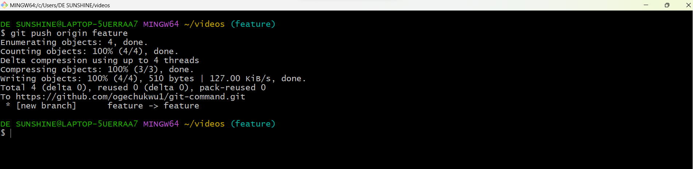

# Git-project

## what is Git

Git is a free and open source distributed version control system (VCS) designed to handle everything from small to very large projects with speed and efficiency.

Git is used to tracking changes in the source code, enabling multiple developers to work together on non-linear development.

__GIT COMMANDS__

__Initializing Git__

__git init__ is the first command that you will run on Git. The git init command is used to create a new blank repository.

`git init`

_create a folder_ (`mkdir videos`)

_cd into the folder_ (`cd videos`)

_then run the (`git init`) command_

__MAKING COMMIT__

__git commit__ is used to save your changes to the local repository. Note that you have to be very specific by telling Git which changes you want to include in a commit. Using the `git commit` command only saves a new commit object in the local Git repository. 

_create a file inside the folder_ (`touch Avatar.txt`)

_write a text inside the file_ (`echo "this is my first movie" > Avatar.txt`)

_to see your text, (`cat Avatar.txt`)_

_next you add a change in the working directory to the staging area. (`git add .`)_

_then to commit your change, you run this (`git commit -a -m "my first commit"`)

__important parameters__

(`-m`) _means __message___

_Sets the commit's message that helps your teammates (and yourself) understand what happened._

(`-a`) _means __All___

_Includes all currently changed files in this commit._

__WORKING WITH BRANCHES__

__git branches__ command lets you create, list, rename, and delete branches. 

__NOTE__

To list all branches and see what branch you are on, __the asterisk(*) denotes the current branch__ (`git branch`)

To list all branches __both local and remote__ (`git branch -a`)

To create a new branch (`git branch [branch name]`)

To delete a branch (`git branch -d [branch name]`)

To see remote branches (`git branch -r`)

__RUN COMMANDS__

_Create git branch_ (`git branch feature`)

_list your branch_ (`git branch`)

_switch to your new branch_ (`git switch feature`)

_lets add the content of `master branch` into `feature branch`_ (__`git merge master`__)

__create a repository on github__

_give it any name of your choice and click on create repository_

_having created your github account and github repository_

_lets send copy of our work to our repository in github_

_add the remote repository(github) to the local machine(git bash terminal)_

`git remote add origin <link to your github repo>`

`git remote add origin https://github.com/ogechukwu1/git-command.git`

_you push the content to the remote repo_

`git push origin feature`

